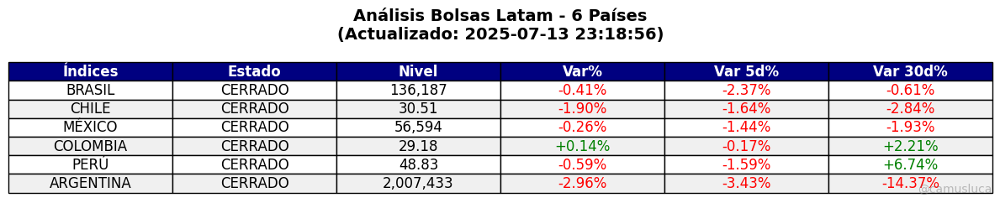
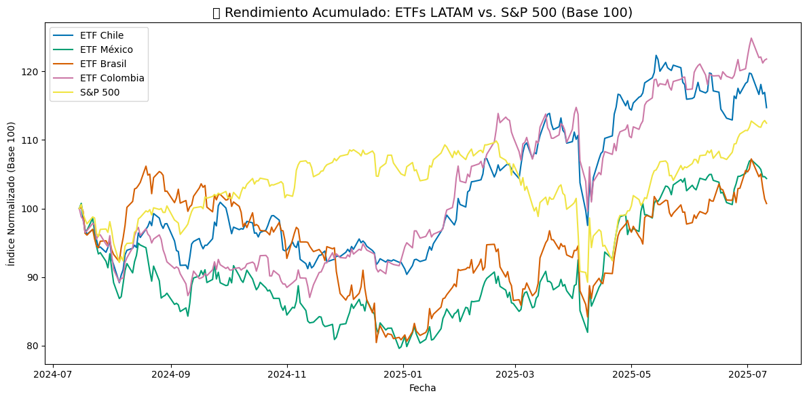
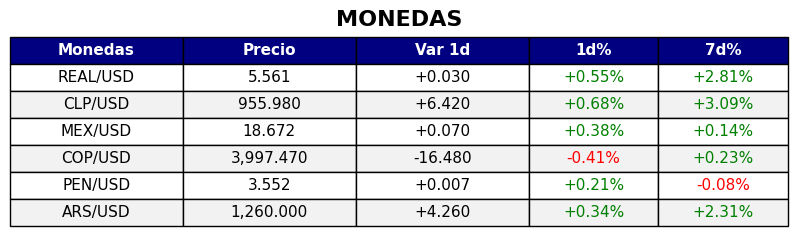
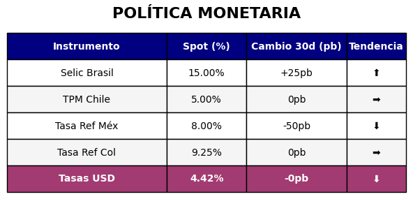

# Update LATAM Market

Este proyecto en Python automatiza la recolección, procesamiento y visualización de datos financieros clave para América Latina. Genera un **resumen gráfico semanal** con:

- Principales bolsas de LATAM.
- Rendimiento de los mercados.
- - Tipo de cambio (monedas de LATAM frente al dólar)
- Precios de commodities clave para la región
- Tasas de política monetaria

---

## Objetivo

Automatizar un **dashboard económico-financiero** actualizado semanal/diariamente, ideal para analistas, estudiantes de economía, inversionistas y profesionales de mercados emergentes. Los datos se presentan en tablas limpias y visuales, y se pueden compartir fácilmente en las redes sociales.

---

##  Tecnologías utilizadas

- `Python 3.10+`
- `pandas`, `requests`, `BeautifulSoup`, `yfinance`, `matplotlib`
- APIs oficiales:
  - Banco Central de Chile (BCCh)
  - Banco Central de Brasil (BCB)
  - Banxico
  - Banco de la República de Colombia (BanRep)
  - (En desarrollo: FRED – Fed de EE.UU.)

---

## Estructura del proyecto
### 1. Mercados

---

### 2. ETF's

---

### 3. Tipo de Cambio LATAM

Consulta de monedas vs. USD:

- 

---

### 4. Commodities

Seguimiento de precios y cambios de commodities estratégicos:

---

### 5. Política Monetaria

Obtención automática de tasas actuales y variaciones a 30 días de:

---

## Visualización

Las imágenes se guardan automáticamente como PNG en alta resolución con colores y emojis para facilitar la lectura visual. Ideales para reportes o publicaciones en redes.

---

## Cómo usar

1. Abrí el notebook en [Google Colab](https://colab.research.google.com/drive/14yDqOLZqsPcyQlTrI3wZjBpBJRuuNGfV)
2. Instalá las dependencias (`yfinance`, `bs4`, etc.)
3. Ejecutá todas las celdas
4. Se generarán imágenes `.png` y tablas en consola

---

## Próximos pasos

- Automatizar México y Colombia con API de Bancos Centrales
- Agregar bonos soberanos
- Dashboard dinámico
- Subida automática de imagen a LinkedIn
- Versión en inglés

---

## Contacto

Proyecto creado por **[Luca Camus]**, estudiante de Economía y alguna cosita de mercados financieros.

- LinkedIn: [luca-camus]
- GitHub: [lucacamus13]
- Email: [luca.camus@fce.uncu.edu.ar]

---

## Créditos y fuentes

- Banco Central de Chile (BCCh)
- Banco Central de Brasil (BCB)
- Reserva Federal de St. Louis (FRED)
- Yahoo Finance
- Investing.com

---

## Notas

- `🤖`: automatizado
- `⬆️ / ⬇️ / ➡️`: tendencia vs 30 días (sube, baja, estable)
- `pb`: puntos básicos (1% = 100 pb)

---

